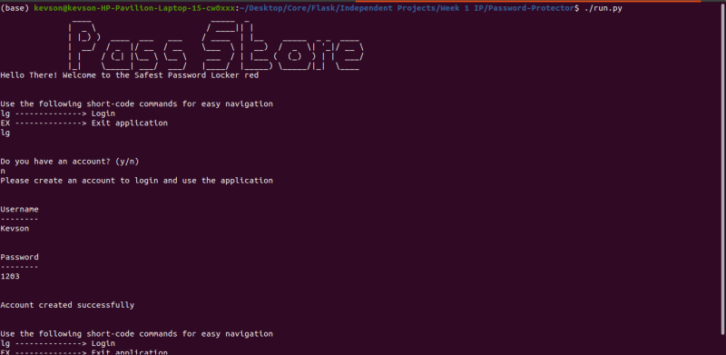
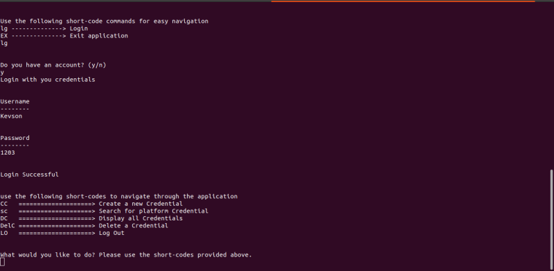

# Password Locker.

## Author
* Nyambura Kelvin Njuguna

## Description
* This is a python application that can be used to manage passwords for different platforms that the user may have.,
To use the application, the user has to create an account and use the created account to log in. Thereafter, they can 
use the provided short codes provided in run-time to navigate through the application.

## ScreenShot of the application

### screenshot 1 (creating an account)

### Screenshot 2 (Loging in using the created credentials)

## BDD.
* The user can:
1. Create a password locker account with a login username and a password.
2. Use the account details to log in to the password locker application.
3. Store existing account credentials in the application.
4. Create new account credentials in the application
- when creating the account, the user can choose to either create their own password or autogenerate one.
5. View the various account credentials stored in the application.
6. Search for a saved credential by platform name.
7. Delete a credential that they no longer deem important from the application.

# Installation & Setup instructions

## The application requires the following dependencies to run.

* python3.8 or a newer version.
* pip

### Cloning the application

* Open the terminal (Ctrl + Alt + T)
* $ git clone https://github.com/Kevson102/Password-Locker.git
* cd Password-Locker
* code .
- Please note that the last command above may differ depending on your preferred text editor

### Running the Application
- In the terminal, navigate to the Password-Locker directory and run the following commands
* $ chmod +x run.py
* $ ./run.py

# Technologies used.
* python3.8

# Known Bugs.
* None at the moment

# Contact information

* phone: (+254) 733 916258
* E-mail: Kevson3941@gmail.com

# License
* <a href="LICENSE.MD" target = "_blank">MIT License</a>

* Copyright (c) 2021 Kelvin Njuguna